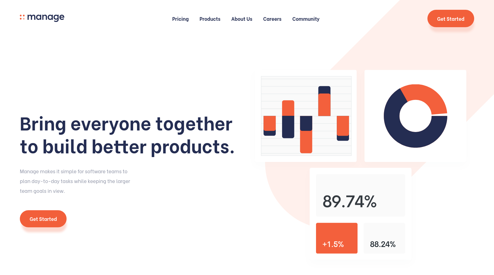
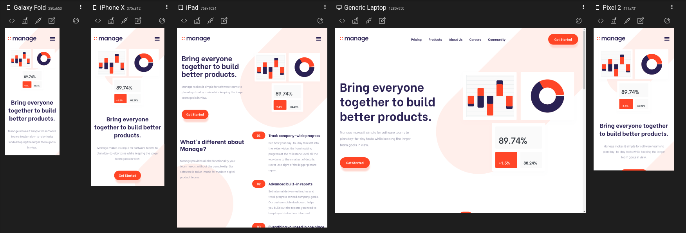
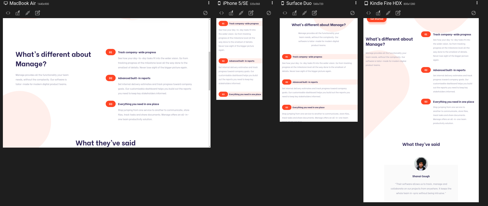
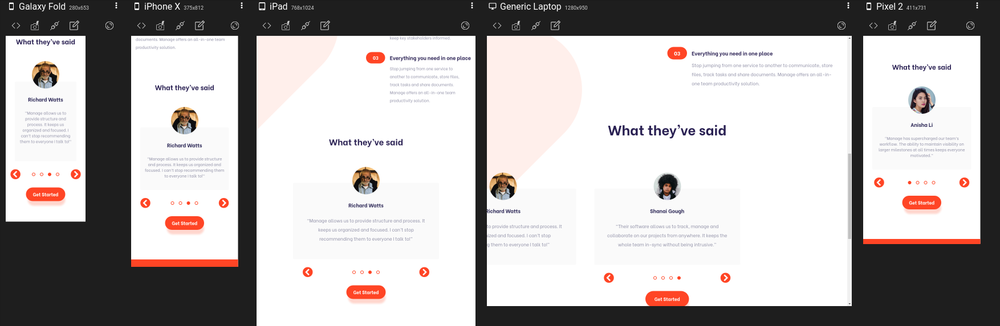
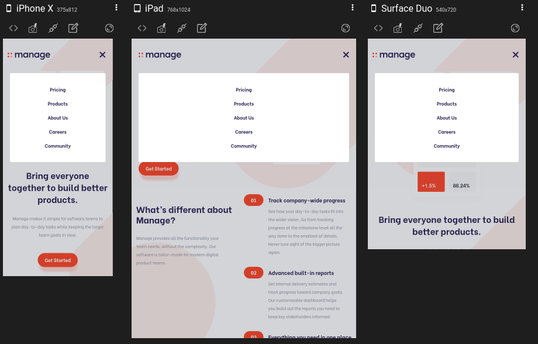
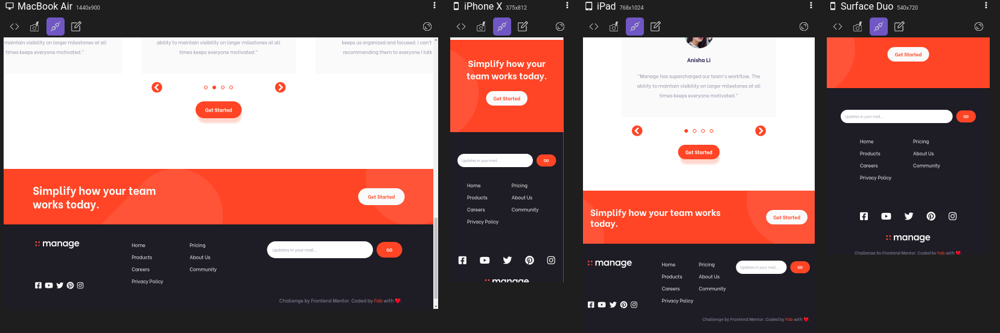

# Frontend Mentor - Manage landing page solution

## Check it out Live -> [Here](https://fab-manage.netlify.app/)

This is a solution to the [Manage landing page challenge on Frontend Mentor](https://www.frontendmentor.io/challenges/manage-landing-page-SLXqC6P5). Frontend Mentor challenges help you improve your coding skills by building realistic projects.

## Table of contents

- [Overview](#overview)
  - [The challenge](#the-challenge)
  - [Screenshot](#screenshot)
  - [Links](#links)
- [My process](#my-process)
  - [Built with](#built-with)
  - [What I learned](#what-i-learned)
  - [Useful resources](#useful-resources)
- [Author](#author)

## Overview

This was a nice challenge to refresh and check my skills as I didn't code much in the last few months. I had fun figuring out the carousel/slider stuff.

### The challenge

#### ALL DONE

Users should be able to:

- ✅ View the optimal layout for the site depending on their device's screen size
- ✅ See hover states for all interactive elements on the page
- ✅ See all testimonials in a horizontal slider
- ✅ Receive an error message when the newsletter sign up `form` is submitted if:
  - ✅ The `input` field is empty
  - ✅ The email address is not formatted correctly

### Screenshot

PS: These screenshots are from [Responsively App](https://responsively.app/), I used to develop the website, it's a developers browser. (I did use Firefox and Chrome before I used this app but switched only when I needed to cross check something or use Firefox DevTools for CSS.)

### Links

- Solution URL: [Add solution URL here](https://github.com/fabcodingzest/FE-manage-Landing-Page)
- Live Site URL: [Add live site URL here](https://fab-manage.netlify.app/)

## My process

I went easy and did a section a day or sometimes two when I didn't feel like it haha, my approach with tailwind was to make the whole section responsive followed by the next section with mobile first approach ofcourse as it's really easy peasy lemon squeezy with tailwind. The carousel/slider part took most of my time as I had to search a lot and there were no exact tutorials for what I wanted so I had to think how to combine what I want from the tutorials I did and tweak them. All in all it was fun.

### Built with

- Semantic HTML5 markup
- [TailwindCSS](https://tailwindcss.com/)
- Flexbox
- CSS Grid
- Mobile-first workflow
- JavaScript

### What I learned

- I learned to work with TailwindCSS @apply because writing repetitive patterns cluttered the HTML markup.
- I learned how to make a carousel with pure HTML, CSS, and JavaScript with the help of tons of tutorials, followed by tweaking and combining them to have the features I wanted, there is a lot I could still do, but for now, this is enough for the landing page.
- After completing the project, I wanted to find a way so I won't have to build my CSS every time changes in `tailwind.config.js` and `tailwind.css` files occur, so I searched a lot and discovered [Tailwind JIT Mode(Just in Time)](https://tailwindcss.com/docs/just-in-time-mode). JIT in Tailwind is a blessing XD.

### Useful resources

- [Testimonial Slider](https://www.youtube.com/watch?v=fzgLWi40-2g&list=LL&index=6) - This is an amazing video which exactly helped me with the positioning of the testimonial section, I only picked out few things which I wanted.

- [Image Slider](https://www.youtube.com/watch?v=0wvrlOyGlq0&list=LL&index=8&t=616s) - This helped me but again,I just picked up some styling from the tutorial as radio buttons for slider was way too complicated for me so that was taken from the other tutorial(mentioned above).

## Author

- Website - [Fab](https://linktr.ee/fabcodingzest)
- Frontend Mentor - [@fabcodingzest](https://www.frontendmentor.io/profile/fabcodingzest)
- Twitter - [@fabcodingzest](https://www.twitter.com/fabcodingzest)
